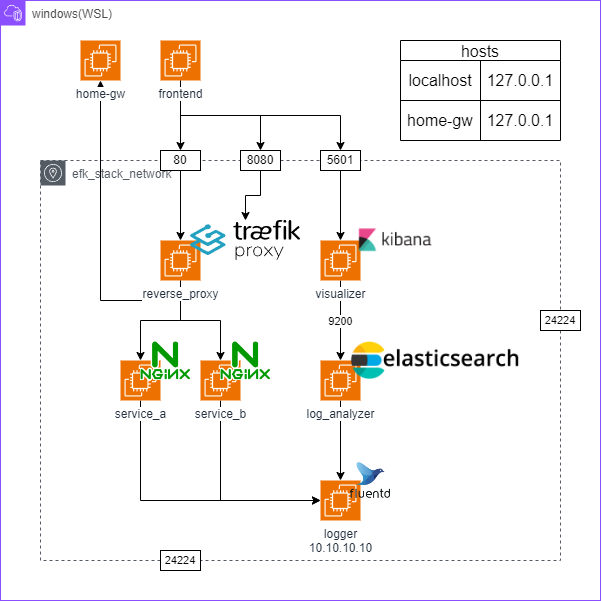

# Fluentdを使ってみよう

## NW構成



## 追加設定

一番下の項目を追加する。

`C:\Windows\System32\drivers\etc\hosts`

```hosts
# Copyright (c) 1993-2009 Microsoft Corp.
# Added by Docker Desktop
192.168.0.163 host.docker.internal
192.168.0.163 gateway.docker.internal
# To allow the same kube context to work on the host and the container:
127.0.0.1 kubernetes.docker.internal

# Original
127.0.0.1 gw.local

# End of section
```

## 実行方法

### 作成

```console
$ docker compose up -d
```

### 削除

```console
$ docker compose down --volumes
```

## Kibanaへの接続

[visualizerサービス（kibanaコンテナ）](http://localhost:5601/app/management/kibana/dataViews)へアクセスする。

Kibanaの使い方は[こちら](./doc//kibana/how_to_use.md)

## Traefikへの接続

[reverse_proxyサービス](http://localhost:8080/dashboard/#/)の8080ポートへアクセスする。

## 使い方

- [ルーター](./doc/how-to-use/home-gw.md)
- [サービスA](./doc/how-to-use/service-a.md)

## 参考

- [fluentd Doc](https://docs.fluentd.org/)
