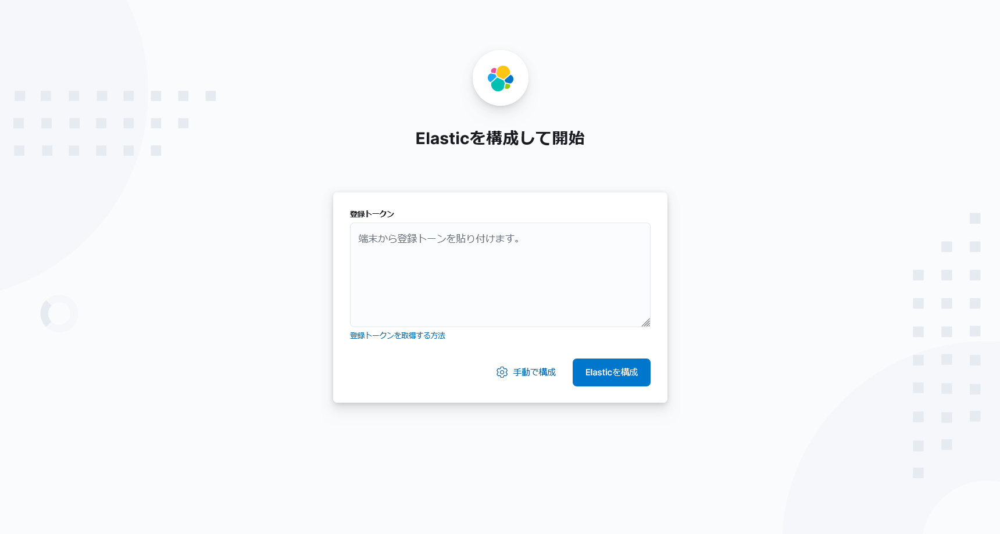
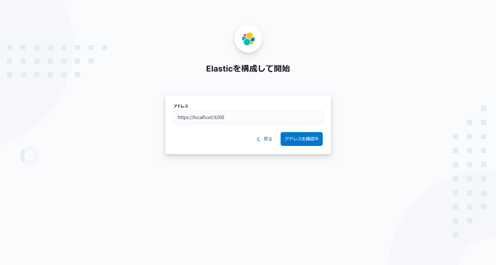
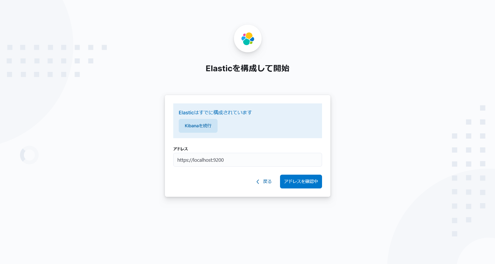

# Fluentdを使ってみよう

## 立ち上げ

```console
$ docker compose up -d
[+] Running 8/8
 ✔ Network fluentd_default            Created 0.2s
 ✔ Volume "elastic_storage"           Created 0.0s
 ✔ Container fluentd-log_analyzer-1   Started 0.1s
 ✔ Container fluentd-reverse_proxy-1  Started 0.1s
 ✔ Container fluentd-logger-1         Started 0.1s
 ✔ Container fluentd-kibana-1         Started 0.1s
 ✔ Container fluentd-service_b-1      Started 0.1s
 ✔ Container fluentd-service_a-1      Started 0.1s
```

## Kibanaへの接続

[visualizerサービス（kibanaコンテナ）](http://localhost:5601/app/management/kibana/dataViews)へアクセスする。
【手動で構成】を押下する。



環境変数`ELASTICSEARCH_HOSTS`のURLが記入されているので、【アドレスを確認中】を押下する。



【kibana】を実行を押下してkibanaコンソールへ入る。



## Traefikへの接続

[http://localhost:8080/dashboard/#/](http://localhost:8080/dashboard/#/)

## 使い方

### サービスAへのアクセス

```console
$ curl http://localhost/service-a.html
```

`service-a`サービスに以下のログが表示される。

```log
192.168.224.3 - - [03/Feb/2024:16:41:49 +0000] "GET /service-a.html HTTP/1.1" 200 9 "-" "Mozilla/5.0 (Windows NT 10.0; Win64; x64; rv:122.0) Gecko/20100101 Firefox/122.0" "192.168.224.1"
```

このログが`fluentd`によって成形されて、`logger`サービスに以下のログが表示される。

### loggerサービス

> 時刻が一致していることが分かる。また、json部分をフォーマットした。

```json
2024-02-03 16:41:49.000000000 +0000 service.a.access: 
{
    "container_id":"1648991bc7e760d11ce41fe8b619c6ee6b6797042a7cff1778a8d25ca8ef1e89",
    "container_name":"/fluentd-service_a-1",
    "source":"stdout",
    "log":"192.168.224.3 - - [03/Feb/2024:16:41:49 +0000] \"GET /service-a.html HTTP/1.1\" 200 9 \"-\" \"Mozilla/5.0 (Windows NT 10.0; Win64; x64; rv:122.0) Gecko/20100101 Firefox/122.0\" \"192.168.224.1\""
}
```

`logger`サービスの`fluentd`が、`log_analyzer`サービスの`elasticsearch`へ転送する。  
ただし、`elasticsearch`のログは自身に関するログのみ取り扱うため、ログファイルで見ることはできない。  

### log-analyzerサービス

この`elasticsearch`がため込んだログを`visualizer`サービスの`kibana`が取得してブラウザに表示してくれる。

```json
{
  "@log_name": [
    "service.a.access"
  ],
  "@log_name.keyword": [
    "service.a.access"
  ],
  "@timestamp": [
    "2024-02-03T16:41:49.000Z"
  ],
  "container_id": [
    "1648991bc7e760d11ce41fe8b619c6ee6b6797042a7cff1778a8d25ca8ef1e89"
  ],
  "container_id.keyword": [
    "1648991bc7e760d11ce41fe8b619c6ee6b6797042a7cff1778a8d25ca8ef1e89"
  ],
  "container_name": [
    "/fluentd-service_a-1"
  ],
  "container_name.keyword": [
    "/fluentd-service_a-1"
  ],
  "log": [
    "192.168.224.3 - - [03/Feb/2024:16:41:49 +0000] \"GET /service-a.html HTTP/1.1\" 200 9 \"-\" \"Mozilla/5.0 (Windows NT 10.0; Win64; x64; rv:122.0) Gecko/20100101 Firefox/122.0\" \"192.168.224.1\""
  ],
  "log.keyword": [
    "192.168.224.3 - - [03/Feb/2024:16:41:49 +0000] \"GET /service-a.html HTTP/1.1\" 200 9 \"-\" \"Mozilla/5.0 (Windows NT 10.0; Win64; x64; rv:122.0) Gecko/20100101 Firefox/122.0\" \"192.168.224.1\""
  ],
  "source": [
    "stdout"
  ],
  "source.keyword": [
    "stdout"
  ],
  "_id": "y7jZb40BnV6UTq31CZSP",
  "_index": "nginx-a-log-20240203",
  "_score": null
}
```

## 参考

- [fluentd Doc](https://docs.fluentd.org/)
