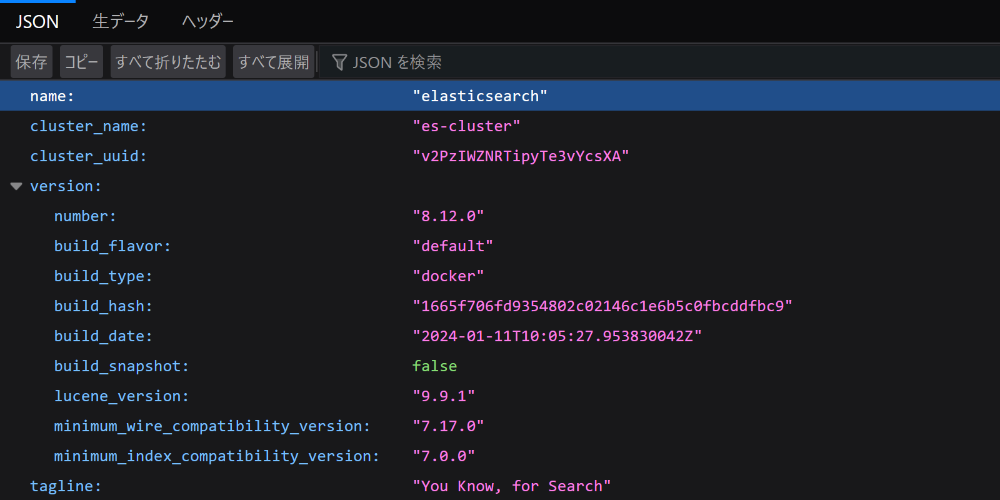

# Elasticsearch

## kibanaとElasticsearchの接続

kibana側に`Elasticsearch`の接続アドレスが設定されている。

```yaml
    visualizer:
      build: kibana/
      hostname: kibana
      ports:
        # WEB UI
        - target: 5601
          published: 5601
      environment:
        # log_analyzer service's hostname
        - ELASTICSEARCH_HOSTS=http://elasticsearch:9200
        - TZ=Asia/Tokyo
        - I18N_LOCALE=ja-JP
      depends_on:
        - log_analyzer
      restart: always
      networks:
        efk_stack_network:
```

環境変数を見てkibanaはElasticsearchへ接続する。

## 9200番ポートに接続すると何が見れるのか？

webページで設定が見れるようになっている。



## 9200番ポートは公開されるべきか？

あらゆるサービスが接続されるなら公開されるべきだろう。  
今回のdocker環境は、docker環境内からのサービスのみをElasticsearchに送信することを目的としているので、公開しないこととする。  
これは、`fluentd`のloggerサーバーが24224ポートを公開していないのと同じ考えだ。
