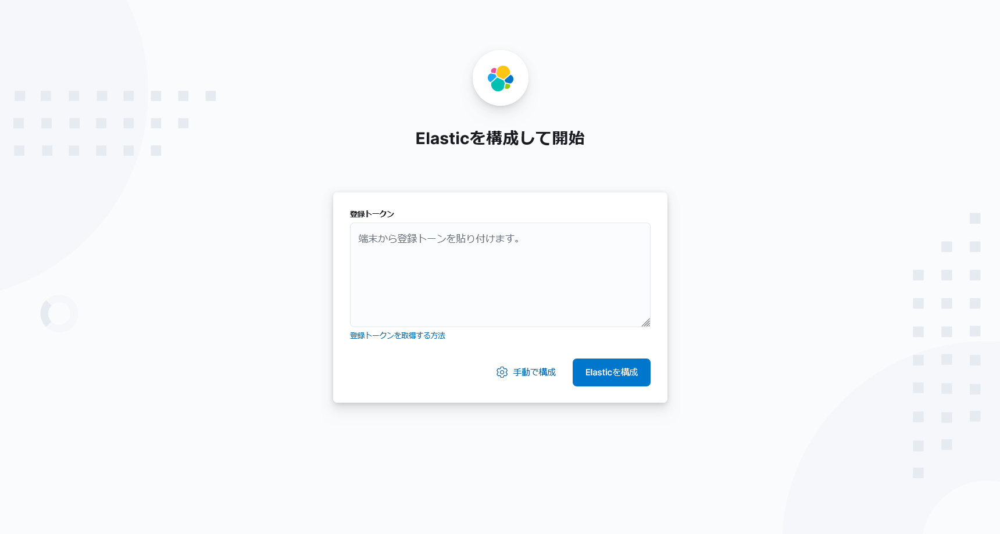
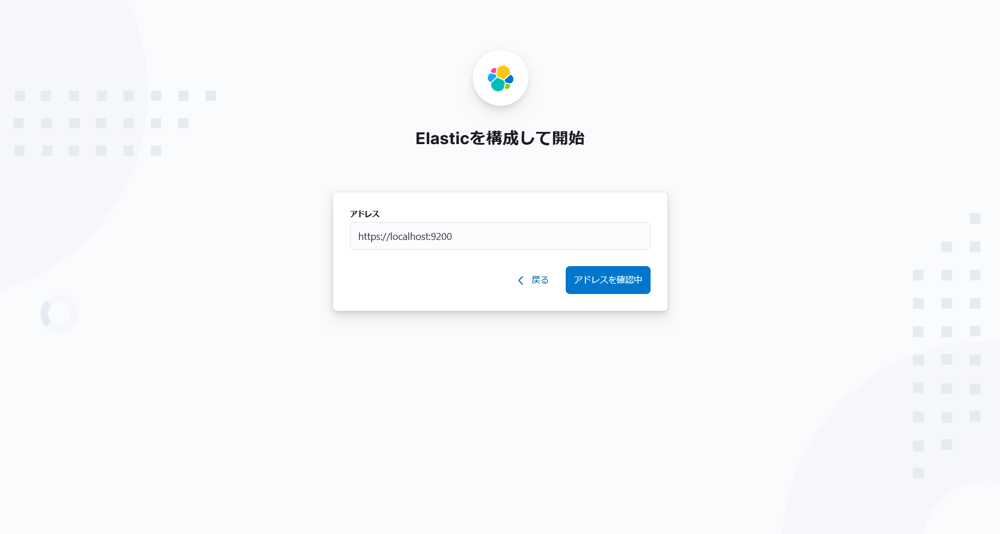
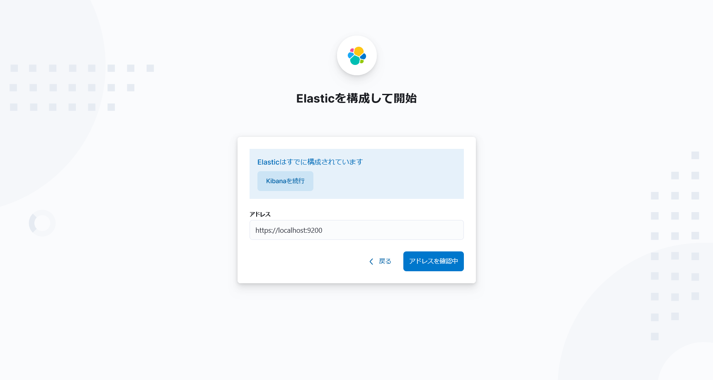
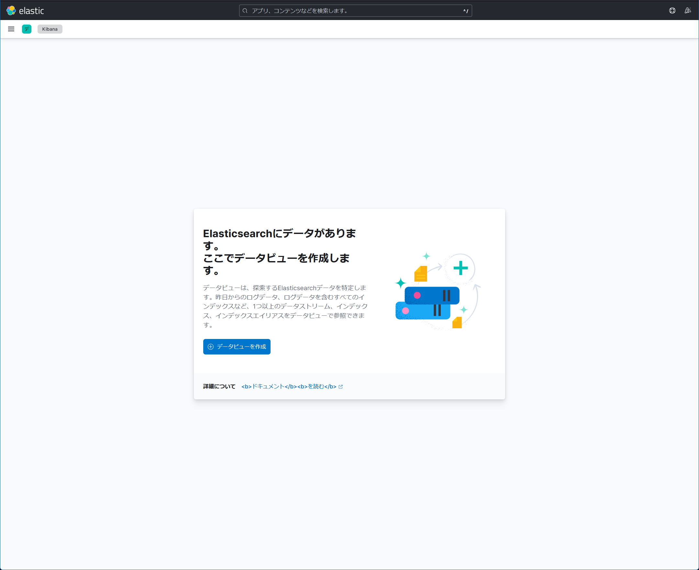
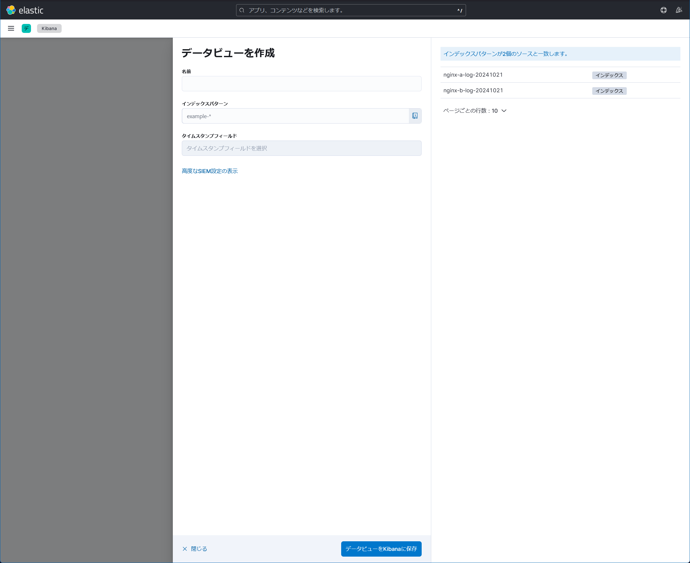
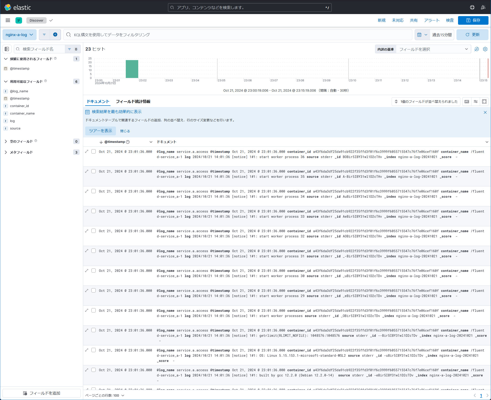

# kibanaの使い方

## 初期設定

【手動で構成】を押下する。

環境変数`ELASTICSEARCH_HOSTS`のURLが記入されているので、【アドレスを確認中】を押下する。

【kibana】を実行を押下してkibanaコンソールへ入る。

## データビューの構築

データビューが無い場合、チュートリアル画面が表示される。

データビューを作成するには、以下の情報を入力する

- 名前：データビューの名前。`nginx-a-log`など分かり易い名前がよい
- タイムスタンプフィールド
- etc...

> インデックスパターンはソースをgrepする条件なだけでデータビューに関連するデータではない。

## データビューの閲覧

## 参考

- [Kibanaの使い方](https://qiita.com/namutaka/items/b67290e75cbd74cd9a2f)
