# Dockerにおける別のNW内の通信経路

## NW図



クライアントを一つのネットワークに所属させる。（抜粋）

```yaml
# client
  client_in_nw2:
    container_name: client_in_nw2
    hostname: client
    networks:
      - seg4nw1
# server
  server_in_nw2:
    container_name: server_in_nw2
    hostname: server
    networks:
      - seg4nw2
```

## ルーティングテーブルの確認

```console
root@client(10.20.10.2):/ # ip route
default via 10.20.10.1 dev eth0
10.20.10.0/24 dev eth0 proto kernel scope link src 10.20.10.2
```

日本語に直すと

- 送信先`default`（他以外）へのルートは`eth0`を使って`10.20.10.1`へ転送しますよ
- 送信元`10.20.10.2`（自身）から送信先`10.20.10.0/24`へのルートは`eth0`を使いますよ

同じネットワーク(`10.20.10.0/24`)内の宛先であれば、`eth0`を使ってルーティングする。  
違うネットワークへは`default`が肩代わりする。

## 疎通の確認

### ホスト指定の場合

ホスト名`server`へ通信してみよう。  
詳しい情報として、このホスト`server`は別のネットワークに所属しており、IPアドレスは`10.20.20.2`である。

まず、`server`というホスト名が名前解決できるかを調べる。

```console
root@client(10.20.10.2):/ # nslookup server
;; communications error to 127.0.0.11#53: timed out
;; communications error to 127.0.0.11#53: timed out
;; communications error to 127.0.0.11#53: timed out
;; no servers could be reached
```

やはり、`10.20.10.0/24`内から検索するが見つからない。  
よって、ルートテーブルとしては、`default`を使って外のDNSに名前解決を依頼する。  
しかし、そんな名前のレコードは存在しないために、名前解決に失敗する。

```console
root@client(10.20.10.2):/ # ping server
ping: server: Temporary failure in name resolution
```

### IP指定の場合

`server`へは、ホスト名での接続が名前解決できないことで不可能であることが分かった。  
次は、直接IPアドレスを指定して通信してみる。

IPアドレスを使っても`10.20.10.0/24`のネットワーク内に存在しないため、`default`が肩代わりをする。  
この`default`が`10.20.20.2`に通信しようとするが、宛先を頑張って探すものの応答はない。

```console
root@client(10.20.10.2):/ # ping 10.20.20.2
PING 10.20.20.2 (10.20.20.2) 56(84) bytes of data.
（応答がない）
```
