# Dockerにおける別のNW内の通信経路

## NW図



クライアントを二つのネットワークに所属させる。

```yaml
  client_in_nw2:
    container_name: client_in_nw2
    build:
      context: ./dockerfiles
      dockerfile: client.Dockerfile
    hostname: client
    networks:
      - seg4nw1
      - seg4nw2
    stdin_open: true # -i
    tty: true # -t
```

## ルーティングテーブルの確認

新たなNIC(eth1)が確認できる。

```console
root@client(10.20.20.3 10.20.10.2):/ # ip route
default via 10.20.10.1 dev eth0
10.20.10.0/24 dev eth0 proto kernel scope link src 10.20.10.2
10.20.20.0/24 dev eth1 proto kernel scope link src 10.20.20.3
```

`10.20.20.0/24`が追加されたので疎通しそう。

## 経路の確認

```console
root@client(10.20.10.2 10.20.20.3):/ # traceroute server
traceroute to server (10.20.20.2), 30 hops max, 60 byte packets
 1  server_in_nw2.network_seg4nw2 (10.20.20.2)  1.144 ms  0.698 ms  0.645 ms
```

ちゃんと名前解決もできている。

## 遠隔ログインの確認

```console
root@client(10.20.10.2 10.20.20.3):/ # telnet server 23
Trying 10.20.20.2...
Connected to server.
Escape character is '^]'.
Ubuntu 22.04.2 LTS
server login: docker
Password: 
Welcome to Ubuntu 22.04.2 LTS (GNU/Linux 5.15.90.1-microsoft-standard-WSL2 x86_64)

 * Documentation:  https://help.ubuntu.com
 * Management:     https://landscape.canonical.com
 * Support:        https://ubuntu.com/advantage

This system has been minimized by removing packages and content that are
not required on a system that users do not log into.

To restore this content, you can run the 'unminimize' command.

The programs included with the Ubuntu system are free software;
the exact distribution terms for each program are described in the
individual files in /usr/share/doc/*/copyright.

Ubuntu comes with ABSOLUTELY NO WARRANTY, to the extent permitted by
applicable law.

$ 
```

ログインできた。
