# Dockerにおける同じNW内の通信経路

同じネットワーク内のコンテナは以下の情報で通信できる。

- IPアドレス
- コンテナ名

> コンテナ名がDNSに登録されると思えばいい

## NW図



## ルーティングテーブルの確認

```console
root@client(10.10.0.2):/ # ip route
default via 10.10.0.1 dev eth0
10.10.0.0/16 dev eth0 proto kernel scope link src 10.10.0.2
```

`10.10.0.0/16`のネットワークは直接通信するが、それ以外は`default`が外側へ通信をかけてくれる。

## ローカルネット内の通信経路について

```console
root@client(10.10.0.2):/ # traceroute server
traceroute to server (10.10.0.3), 30 hops max, 60 byte packets
 1  server_in_nw1.network_seg3nw (10.10.0.3)  0.707 ms  0.466 ms  0.425 ms
```

1ホップで通信できることが分かる。

### 遠隔ログイン

ホスト名を指定しても、nameserver(`127.0.0.11`)に問い合わせてIPアドレスを照会してくれるので問題ない。

```console
root@client(10.10.0.2):/ # telnet server 23
Trying 10.10.0.3...
Connected to server.
Escape character is '^]'.
Ubuntu 22.04.2 LTS
server login: docker
Password: 
Welcome to Ubuntu 22.04.2 LTS (GNU/Linux 5.15.90.1-microsoft-standard-WSL2 x86_64)

 * Documentation:  https://help.ubuntu.com
 * Management:     https://landscape.canonical.com
 * Support:        https://ubuntu.com/advantage

This system has been minimized by removing packages and content that are
not required on a system that users do not log into.

To restore this content, you can run the 'unminimize' command.
Last login: Sat Jul  8 17:34:11 UTC 2023 from client_in_nw1.network_seg3nw on pts/1
$ 
```

server側にちゃんとログインできた。

> server側にログインした後、`exit`すると当然コンテナが死ぬ。  
> どうしたらコンテナを残してログアウトするとかは不明。  
> コンテナって元々そういうもんでもないけど、クラウドサービスはどうしているんだろうか？

## インターネットへお通信経路について

試しに`google.co.jp`への経路を調べてみる。

```console
root@client(10.10.0.2):/ # traceroute google.co.jp
traceroute to google.co.jp (172.217.25.163), 30 hops max, 60 byte packets
 1  10.10.0.1 (10.10.0.1)  0.719 ms  0.574 ms  0.560 ms
 2  192.168.65.5 (192.168.65.5)  0.549 ms  0.428 ms  0.359 ms
 3  * * *
 4  * * *
 5  * * *
 6  * * *
 7  * * *
 8  * * *
 9  * * *
10  * * *
11  * * *
12  * * *
13  * * *
14  * * *
15  * * *
16  * * *
17  * * *
18  * * *
19  * * *
20  * * *
21  * * *
22  * * *
23  * * *
24  * * *
25  * * *
26  * * *
27  * * *
28  * * *
29  * * *
30  * * *
```

30ホップかけても到達しないので諦めてしまった。  
ちゃんとコンテナネットワークを抜けて、自宅ネットワークの`192.168.66.5`を経由して外へ出ていることがわかる。
