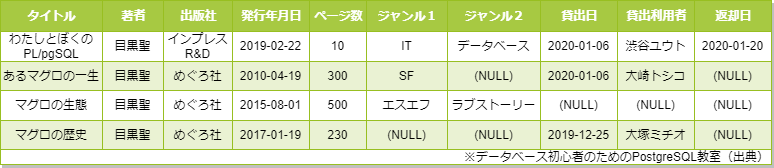
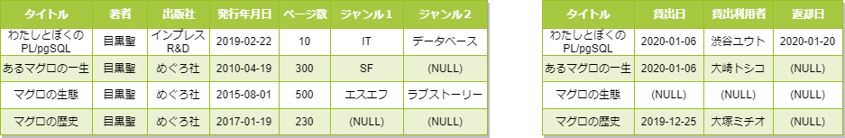
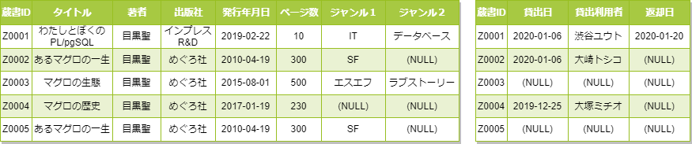
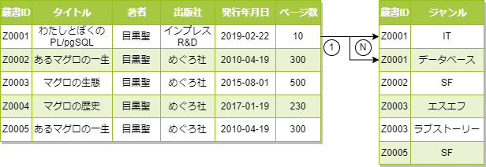
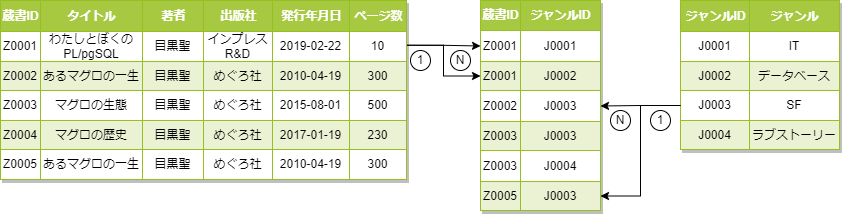
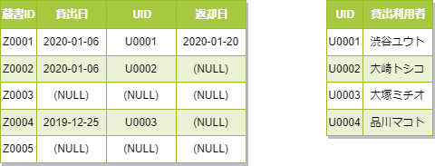
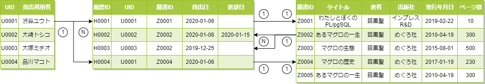
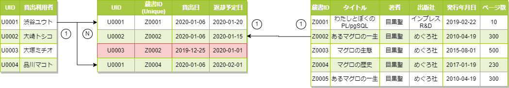

# [テーブルの使い方](https://www.postgresql.jp/document/15/html/managing-databases.html)

## デフォルトのもの

```sql
postgres=# \l
                                                    List of databases
       Name        |  Owner   | Encoding |  Collate   |   Ctype    | ICU Locale | Locale Provider |   Access privileges   
-------------------+----------+----------+------------+------------+------------+-----------------+-----------------------
 postgres          | postgres | UTF8     | en_US.utf8 | en_US.utf8 |            | libc            | 
 template0         | postgres | UTF8     | en_US.utf8 | en_US.utf8 |            | libc            | =c/postgres          +
                   |          |          |            |            |            |                 | postgres=CTc/postgres
 template1         | postgres | UTF8     | en_US.utf8 | en_US.utf8 |            | libc            | =c/postgres          +
                   |          |          |            |            |            |                 | postgres=CTc/postgres
(4 rows)
```

PostgreSQLは１つのインスタンス（DBクラスタ）の中に複数のDBを持つことができることがわかる。

### [template 0](https://www.postgresql.jp/document/15/html/manage-ag-templatedbs.html)

`initdb`を実行した直後の標準オブジェクトのみで構成されているDB。  
システムの初期状態であるので、**決して消してはいけない**。

```sql
CREATE DATABASE hoge TEMPLATE template0;
```

明示的にテンプレートを指定すると設定をクローンしてくれる。

### template 1

PostgreSQLでDBを作成する際のデフォルトのテンプレートとなるDB。  
新規にDBを作る際に常に作成するテーブルや有効にしたい設定を入れておくと、DB作成時に反映してくれる。  
便利～！！

```sql
CREATE DATABASE hoge;
```

明示的にテンプレートを指定しなくても、勝手にtemplate1を反映してくれる。

### postgres

デフォルトの接続先。  
削除しても問題ないが、このDBがあることが前提で接続してくるサービスや拡張機能が多いので止めておいたほうが良い。  
商用環境だとpostgresは分かりにくいので、別のDB名にするなどしよう。

```sql
CREATE DATABASE hoge;
```

## [スキーマ](https://www.postgresql.jp/document/15/html/ddl-schemas.html)

PostgreSQLでのデータを格納する単位は以下の階層構造を持っている。  

- インスタンス
  - データベース
    - スキーマ
      - テーブル
      - テーブル
    - スキーマ
      - テーブル
  - データベース
    - スキーマ
      - テーブル

> MySQLではデータベースとスキーマが同じ概念である。  
> PostgreSQLとは異なるので注意。

階層毎に名前空間が区切られていると思ってよく、別スキーマであれば同名テーブルも定義できる。
デフォルトでは`public`というスキーマが存在する。

とはいえ、MySQLとはスキーマ概念が違うからなぁ。。。  
DB移行とか考えると、余計な機能は使わない方がいい気も。。。

## テーブル

こんなん分からん奴おらんやろ。  
スキップ！！  
[ここ](https://www.postgresql.jp/document/15/html/ddl-basics.html)ら辺読め

### [データ型](https://www.postgresql.jp/document/15/html/datatype.html)

データ型っていっぱいあるんだけど、`variant`型は無いのよ。  
かといって、`text`型は型安全が機能しなくなるから嫌じゃん？  

それは関連テーブルって奴で強引に解決する。

### 正規化

正規化にはいくつか行うモチベーションがある。  
これを知らないとなんでデータを分けるのか分からない。

まず、**要件が定義されないといけない**。

- タイトルや著者などの本の情報が管理したい
- 登録してある利用者の誰か管理したい
- 貸し出すたびに貸出伝票を発行したい
  - 誰が、いつ、どの本を借りたか履歴を管理したい。
  - 誰が、いつ、どの本を返すのかをスケジュールを管理したい

では、データを見てみよう。  



こ、これはひどい。。。すべてのデータが一つで管理されている。  
最初は「すべてのデータ」ってなんやねんとなるはずなので、要件定義が必要なのだ。

要件として出てくるだろうデータは以下である。

- 本自体の情報を表現するデータ
- 利用者の情報を表現するデータ
- 貸出履歴を表現するデータ
- 返却予定を表現するデータ

#### とりあえず、大雑把に分けよう

とりあえず、一つ一つ行きたいので、本と伝票のデータに分けてみよう。



#### 主キーを導入して同名データを管理する

まず、同じ本を複数管理することが考えられる。  
たとえば、【あるマグロの一生】が２冊ある場合、【大崎トシコ】さんが借りたのはどっちか分からないと管理しにくい。  
同じ本でも違うデータとして管理するために蔵書IDを追加してみよう。

これにより、蔵書テーブルの方に蔵書IDが追加され、貸出テーブルには本自体を区別するために蔵書IDで管理されるようになった。

> このIDは、このシステムでのみ使われるIDである。  
> ISDNのような「それ用のデータ」があれば、それで代用することはできる。  
> ただし、シリアル番号など各会社で異なるフォーマットかもしれないし、競合するかもしれないデータは採用できない。  
> あくまで、「**このサービスがシステム都合で管理するデータ**」がPKである。



#### 固定数データからN数データ1:N関係

蔵書テーブルに注目してみる。  
このテーブルだとジャンルは２つまでしか登録できない。  
ジャンルは時代によって呼び名も違えば、新しいジャンルが発掘されるかもしれない。  
3つ目以降のジャンルを登録できるようにしてみる。



3つ目を入れられるようにするつもりでN個のジャンルを入れられるようにした。  
【Z0004】のジャンルデータがデータすら存在しなくなったのでストレージ容量も削減できたぞ。

#### 表記ゆれの解決、N:N関係

次に気になるのは、ジャンルテーブルの【SF】と【エスエフ】が表記ゆれしていることだ。  
これは`text`型データでよくあることで、なんでも入れられるので揺れてしまう。  
また、【SF】をちゃんとした【Sci-Fi】などに書き換えるときにすべてのデータを書き換える必要も出てくる。

【SF】を一つのデータとして取り出してあげよう。



ジャンルIDを付与して、ジャンルテーブルを構築してみた。  
本とジャンルをつなぐN:Nのデータテーブルを交差テーブル、中間テーブルと言ったりもする。

- 本にN個のジャンルをつけることができる
- ジャンルから見てもN個の本が見つかる

#### 利用者を管理しよう

貸出伝票の方に取り掛かろう。  
貸出利用者が誰か分からなければ取り立てることもできないのでユーザーを別管理しよう。



おおい、ユーザーデータを別管理したらさっきまではデータに出てこなかった【品川マコト】ちゃんが出てきたんだが～？  
これで貸し出しをしていないユーザーも管理できるようになった！

#### 貸出履歴を作ろう

今のままでも、この本は誰に、いつ借りられて、いつ返されるかは分かる。  
でも、これまでの履歴が分からないので、履歴を管理する用のテーブルを設けよう。



ここでもIDとIDを紐づける交差テーブルが登場したのでN:N関係が構築されている。  

- ユーザーは、同時に複数の本を借りることができる。
- 本から、今まで借りてきた複数のユーザーを知ることができる。
- 本は同時に複数のユーザーに借りられることができる。（？）

問題として「本は同時に複数のユーザーに借りられることができる」というデータ構成になってしまっている。  
一つのテーブルで【貸出履歴】と【貸出状況】の二つの情報を管理してしまっているのが原因。  

一応、蔵書IDと返却日にUnique制約を持たせて、なんとかできなくもなくもなくもなくない感じはするけど、無理やりやるのではなくちゃんとデータを定義しよう。

#### 貸し出し状況を作ろう

履歴テーブルを現在の状況を見るデータとして使ってしまうと複数のユーザーに借りられる状況を作れてしまうという問題があった。  
そこで、【返却日】を管理していた履歴と違って【返却予定日】を管理するようにしてみよう。



蔵書IDには重複禁止のUnique制約を入れたので、貸出状況テーブルと蔵書テーブルはN:1関係ではなく正しく1:1関係を結べている。  
これにより、同時に借りられようとしている本があれば、このテーブルに書き込みに来た段階で論理エラーが発生して借りられないことになる。

また、返却予定日を管理したことで、貸出状況と貸出履歴を突合して延滞してる人を探し出すこともできるようになった。
